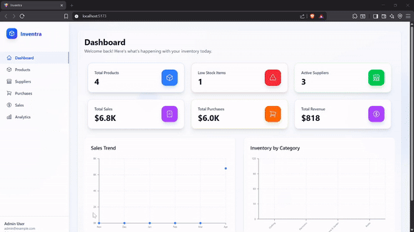
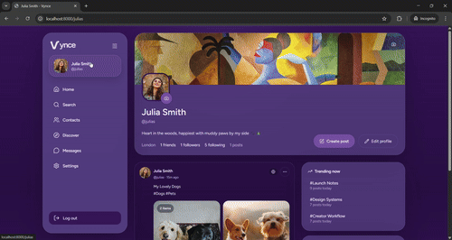
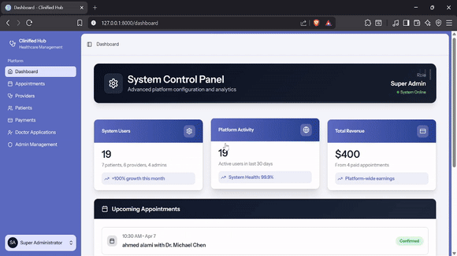
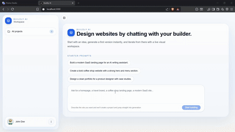
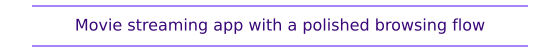
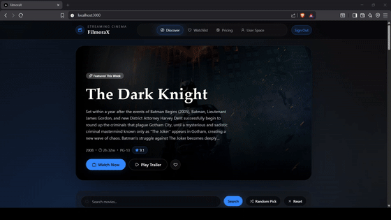

  <strong>Hi there, welcome to my hub 👋</strong>

━━━━━━━━━━━━━━━━━━━━━━━━━━

  <strong>
    <code>W H O&nbsp;&nbsp;I&nbsp;&nbsp;A M</code>
  </strong>

  I’m Aymane Bouljam. 
  I work primarily as a backend developer, with full-stack capabilities when needed. 
  I build clean architectures, robust APIs, scalable systems, and complete products end-to-end.

 

  <strong>
    <code>P H I L O S O P H Y</code>
  </strong>

  Clarity first • Ship complete products • Build for scale

 

  <strong>
    <code>T E C H&nbsp;&nbsp;S T A C K</code>
  </strong>

  I can adapt to different stacks and project needs, but I especially enjoy working with 
  Laravel · PostgreSQL · Next.js · Shadcn/ui · Tailwind CSS

 

  <strong>
    <code>F E A T U R E D&nbsp;&nbsp;W O R K</code>
  </strong>

  A selection of projects I’ve built.

  
<strong>Full Stack Apps</strong>

   

<table align="center" width="100%">
  <tr>
    <td width="50%" valign="top">
      
<strong>INVENTRA</strong>

      

        <picture>
          <source media="(prefers-color-scheme: dark)" srcset="demo/descriptions/inventra.svg" />
          <source media="(prefers-color-scheme: light)" srcset="demo/descriptions/inventra-light.svg" />
          
        </picture>
      

      
    </td>
    <td width="50%" valign="top">
      
<strong>VYNCE</strong>

      

        <picture>
          <source media="(prefers-color-scheme: dark)" srcset="demo/descriptions/vynce.svg" />
          <source media="(prefers-color-scheme: light)" srcset="demo/descriptions/vynce-light.svg" />
          
        </picture>
      

      
    </td>
  </tr>
</table>

<table align="center" width="100%">
  <tr>
    <td width="50%" valign="top">
      
<strong>CLINIFIED HUB</strong>

      

        <picture>
          <source media="(prefers-color-scheme: dark)" srcset="demo/descriptions/clinified-hub.svg" />
          <source media="(prefers-color-scheme: light)" srcset="demo/descriptions/clinified-hub-light.svg" />
          
        </picture>
      

      
    </td>
    <td width="50%" valign="top">
      
<strong>BUILDLY AI</strong>

      

        <picture>
          <source media="(prefers-color-scheme: dark)" srcset="demo/descriptions/buildly-ai.svg" />
          <source media="(prefers-color-scheme: light)" srcset="demo/descriptions/buildly-ai-light.svg" />
          
        </picture>
      

      
    </td>
  </tr>
</table>

<table align="center" width="100%">
  <tr>
    <td width="50%" valign="top">
      
<strong>DOCBOT AI</strong>

      

        <picture>
          <source media="(prefers-color-scheme: dark)" srcset="demo/descriptions/docbot-ai.svg" />
          <source media="(prefers-color-scheme: light)" srcset="demo/descriptions/docbot-ai-light.svg" />
          
        </picture>
      

      
    </td>
    <td width="50%" valign="top">
      
<strong>FILMORAX</strong>

      

        <picture>
          <source media="(prefers-color-scheme: dark)" srcset="demo/descriptions/filmorax.svg" />
          <source media="(prefers-color-scheme: light)" srcset="demo/descriptions/filmorax-light.svg" />
          
        </picture>
      

      
    </td>
  </tr>
</table>

 

  <strong>
    <code>O P E N&nbsp;&nbsp;T O</code>
  </strong>

 

  
  
  
  

 

  <strong>
    <code>C O N T A C T&nbsp;&nbsp;M E</code>
  </strong>

 

  
  
  

 

━━━━━━━━━━━━━━━━━━━━━━━━━━

Open to thoughtful product work 🤝

